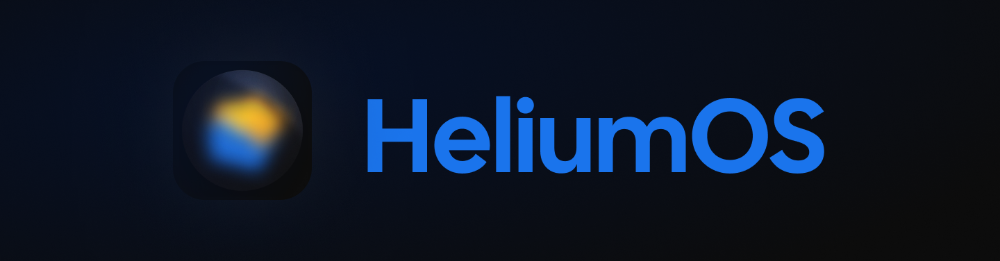
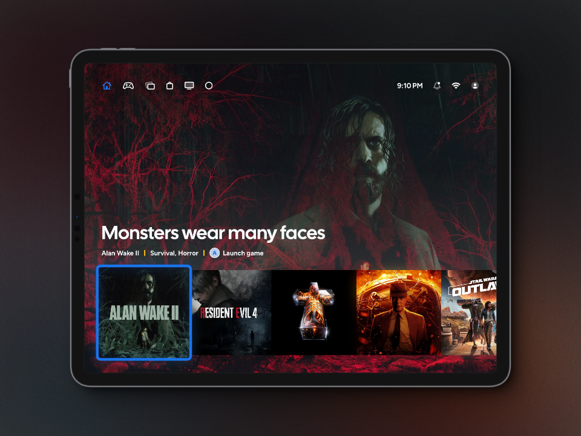
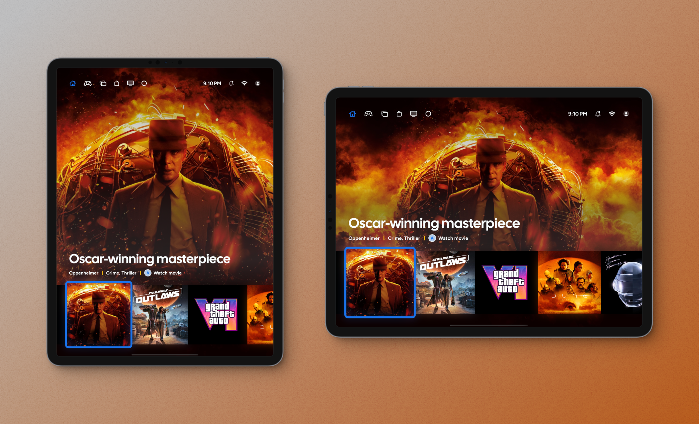
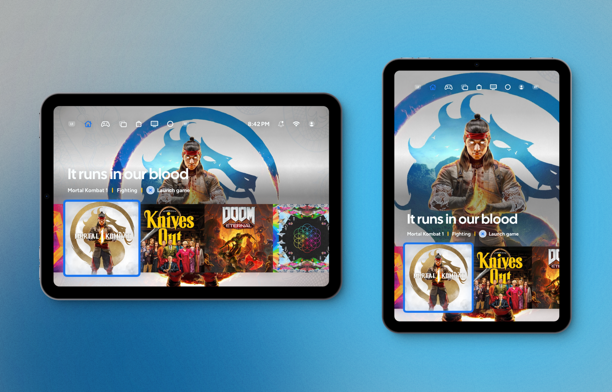

# HeliumOS - made for big screens
An iPad version of HeliumOS, UI designed for the bigger screens.

HeliumOS is a concept operating system created for collecting games, music, movies and apps. Designed for speed and user-friendliness. 

HeliumOS was created in my head back in 2017, originally meant to be tablet OS. Later I redesigned it to work and look stunning on bigger screens. Thanks to responsive UI, HeliumOS is great for resolutions bigger than than a mobile phone screen'.

It started as a first attempt to create a SwiftUI app. Over the years it was my playground to test new SwiftUI features and experiment with GameController library.

Designed, prototyped and coded by me.

_HeliumOS on iPad Pro_

## Demo features
The app consists proof of concept implementation for HeliumOS Home screen. No further navigation, screens or apps are supported.

_HeliumOS on iPad Mini_

### Game Controller support
- User can control the system with connected game controller
- App reacts to connecting and disconnecting the controller by adjusting UI to the user
- Feature was tested with DualSense Wireless Controller
- AdaptiveTriggers support
- Haptics support
- Controller light color matches selected media tile
- Symbols on the buttons match input scheme of the connected controller

### Splash screen
- After app starts, user can see HeliumOS logo that adapts to one of two branding color schemes
- Splash background animates with color scheme tint being more visible

### Home screen
- Change upper main menu selection (with touch or game controller)
- Clock shows real time and animates, when it changes
- Home screen content adapts to media selection (with touch or game controller)
- Background screen show media image or looped video if supported
- Content changes based on the type od selected media
- Navigate to first or last item in media horizontal list (only with game controller)
- Selected media change animates background based on which side the change is coming from (left or right)

## Known issues
- The media item on the left of currently selected item is not fully tappable when not fully visible.

## Original concept from 2017
If you want to see how concept evolved, you can [visit original projects page on Behance](https://www.behance.net/gallery/48880999/Helium-OS-designed-for-future "Project on Behance").

